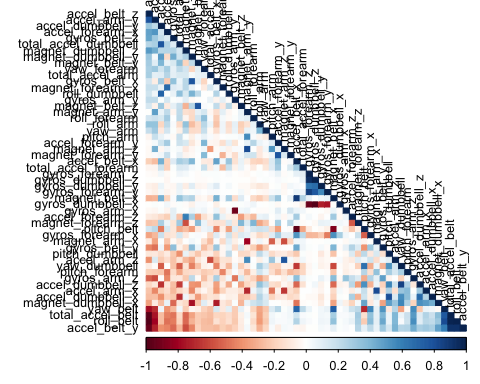
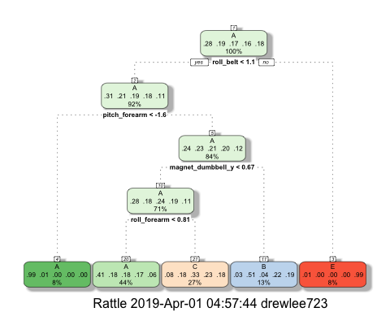

#Background

Using devices such as Jawbone Up, Nike FuelBand, and Fitbit it is now possible to collect a large amount of data about personal activity relatively inexpensively. These type of devices are part of the quantified self movement – a group of enthusiasts who take measurements about themselves regularly to improve their health, to find patterns in their behavior, or because they are tech geeks. One thing that people regularly do is quantify how much of a particular activity they do, but they rarely quantify how well they do it, even though it potentially provides useful information for a large variety of applications,such as sports training.

In this project, the goal was to use data from accelerometers on the belt, forearm, arm, and dumbell of 6 young health participants. They were asked to perform one set of 10 repetitions of the Unilateral Dumbbell Biceps Curl in 5 different fashions: 
*exactly according to the specification (Class A)
*throwing the elbows to the front (Class B)
*lifting the dumbbell only halfway (Class C)
*lowering the dumbbell only halfway (Class D) 
*throwing the hips to the front (Class E).

Class A corresponds to the specified execution of the exercise, while the other 4 classes correspond to common mistakes. Aim of this project was to predict the manner in which they did the exercise. (This is the "classe" variable.)

Below is a report explaining ...
*how the model was built
*how cross validation was used
<what you think the expected out of sample error is>, 
<why you made the choices you did>

and prediction of 20 different test cases using the prediction model. 


#Data sources

The training data for this project are available here:
[website](https://d396qusza40orc.cloudfront.net/predmachlearn/pml-training.csv)
The test data are available here:
[website](https://d396qusza40orc.cloudfront.net/predmachlearn/pml-testing.csv)
The data for this project come from this source: [website](http://web.archive.org/web/20161224072740/http:/groupware.les.inf.puc-rio.br/har)

Full source:
Velloso, E.; Bulling, A.; Gellersen, H.; Ugulino, W.; Fuks, H. [Qualitative Activity Recognition of Weight Lifting Exercises](http://groupware.les.inf.puc-rio.br/public/papers/2013.Velloso.QAR-WLE.pdf). *Proceedings of 4th Augmented Human (AH) International Conference in cooperation with ACM SIGCHI* (Augmented Human'13). Stuttgart, Germany: ACM SIGCHI, 2013.

Special thanks to the above mentioned authors for being so generous in allowing their data to be used for individuals in this kind of courses.


#Reproducibility

In order to reproduce the same results, load the R libraries below which are necessary for the analysis, and set a pseduo-random seed same as the one I used.


```r
library(caret)
```

```
## Loading required package: lattice
```

```
## Loading required package: ggplot2
```

```r
library(corrplot)
```

```
## corrplot 0.84 loaded
```

```r
library(rattle)
```

```
## Rattle: A free graphical interface for data science with R.
## Version 5.2.0 Copyright (c) 2006-2018 Togaware Pty Ltd.
## Type 'rattle()' to shake, rattle, and roll your data.
```

```r
set.seed(19331)
```


#Getting data

Read the training data and replace empty values by NA, and identify set column name differences.


```r
url_training <- 'https://d396qusza40orc.cloudfront.net/predmachlearn/pml-training.csv'
url_testing <- 'https://d396qusza40orc.cloudfront.net/predmachlearn/pml-testing.csv'
download.file(url = url_training, destfile = 'data_train.csv', method="curl")
download.file(url = url_testing, destfile = 'data_test.csv', method="curl")
train_raw <- read.csv(file = 'data_train.csv',
                      na.strings = c('NA','#DIV/0!',''), header=TRUE)
test_raw <- read.csv(file = 'data_test.csv',
                     na.strings = c('NA','#DIV/0!',''), header=TRUE)
#Identify set column name differences
setdiff(names(train_raw), names(train_raw))
```

```
## character(0)
```

```r
setdiff(names(test_raw), names(test_raw))
```

```
## character(0)
```

Verified that the schema of both the training and testing sets are identical, excluding the final column representing the A-E class.


#Cross Validation
The training dataset is then partinioned in 2 to create a Training set (75% of the data, = training) for the modeling process and a Test set (with the remaining 25%, = testing) for the validations. The testing dataset(= test_raw) is not changed and will only be used for the quiz results generation.


```r
inTrain  <- createDataPartition(train_raw$classe, p=0.75, list=FALSE)
training <- train_raw[inTrain, ]
testing  <- train_raw[-inTrain, ]
dim(training); dim(testing)
```

```
## [1] 14718   160
```

```
## [1] 4904  160
```


#Exploratory Data Analysis, and Cleaning

Exploratory Data Analysis reveals datasets have 160 variables, and that the first 7 fields of the data are non-predictive(X, user_name, raw_timestamp_part_1, raw_timestamp_part_2, cvtd_timestamp, new_window, num_window). Also, the data contains a large number of NA values (61% of the data) because many of the variables contain periodic descriptive statistics of other variables. Non-predictive variables and independent variables with more than 90% of NA values are removed from the data set. This will not influence the error rate of the prediction model since these are summary statistics that highly correlate with the other data. 


```r
#Remove non-predictive variables.
training <- training[,-1:-7]
testing <- testing[,-1:-7]

#Remove variables with Nearly Zero Variance
NZV <- nearZeroVar(training)
training <- training[, -NZV]
NZV <- nearZeroVar(testing)
testing <- testing[, -NZV]

#Remove variables with missing data >90%
round(sum(is.na(training))/prod(dim(training))*100)
```

```
## [1] 56
```

```r
count_nas <- apply(training, 2, function(var){
  sum(is.na(var))/length(var)*100
})
training <- training[-which(count_nas>90)]
round(sum(is.na(training))/prod(dim(training))*100)
```

```
## [1] 0
```

```r
round(sum(is.na(testing))/prod(dim(testing))*100)
```

```
## [1] 57
```

```r
count_nas <- apply(testing, 2, function(var){
  sum(is.na(var))/length(var)*100
})
testing <- testing[-which(count_nas>90)]
round(sum(is.na(testing))/prod(dim(testing))*100)
```

```
## [1] 0
```

```r
#check if same variables are left
setdiff(names(training), names(testing))
```

```
## character(0)
```

```r
setdiff(names(testing), names(training))
```

```
## character(0)
```

```r
# check dimensions
dim(training); dim(testing)
```

```
## [1] 14718    53
```

```
## [1] 4904   53
```

```r
#[1] 14718    53
#[1] 4904   53
```

With the cleaning process above, the number of variables for the analysis has been reduced to 53 only.
This leaves 0% of the data with NA values.


#Correlation Analysis
A correlation among variables is analysed before proceeding to the modeling procedures.
<!-- -->

Variables with high correlation are shown in dark colors in the graph above. As seen in the graph, correlations are quite low, thus pca could be skipped for this assignment.


#Preprocessing

```r
preprocessModel <-preProcess(training, method=c('knnImpute', 'center', 'scale'))
pTrain <- predict(preprocessModel, training)
pTrain$classe <- training$classe
pTest <-predict(preprocessModel,testing)
pTest$classe <- testing$classe
```


#Prediction candidates

Three methods were used for prediction :Decision Tree, Random Forests, Gradient Boosting Method(gbm).For each candidate model, predictions are made agaist the cross-validation data set. Then, a confusion matrix is calculated and stored for each model for later reference.

(1) Decision Tree

```r
mod_dt <- train(classe ~ ., data=pTrain, method="rpart",
                trControl = trainControl(method = "cv", 
                                         number = 4, 
                                         allowParallel = TRUE, 
                                         verboseIter = TRUE))
```

```
## + Fold1: cp=0.03389 
## - Fold1: cp=0.03389 
## + Fold2: cp=0.03389 
## - Fold2: cp=0.03389 
## + Fold3: cp=0.03389 
## - Fold3: cp=0.03389 
## + Fold4: cp=0.03389 
## - Fold4: cp=0.03389 
## Aggregating results
## Selecting tuning parameters
## Fitting cp = 0.0339 on full training set
```

```r
fancyRpartPlot(mod_dt$finalModel)
```



```r
pred_dt <- predict(mod_dt, newdata = pTest)
conf_dt <- confusionMatrix(pred_dt, pTest$classe)
```


(2) Random Forests

```r
mod_rf <- train(classe ~ ., data = pTrain, method = 'rf', 
                trControl = trainControl(method = "cv", 
                                         number = 4, 
                                         allowParallel = TRUE, 
                                         verboseIter = TRUE))
```

```
## + Fold1: mtry= 2 
## - Fold1: mtry= 2 
## + Fold1: mtry=27 
## - Fold1: mtry=27 
## + Fold1: mtry=52 
## - Fold1: mtry=52 
## + Fold2: mtry= 2 
## - Fold2: mtry= 2 
## + Fold2: mtry=27 
## - Fold2: mtry=27 
## + Fold2: mtry=52 
## - Fold2: mtry=52 
## + Fold3: mtry= 2 
## - Fold3: mtry= 2 
## + Fold3: mtry=27 
## - Fold3: mtry=27 
## + Fold3: mtry=52 
## - Fold3: mtry=52 
## + Fold4: mtry= 2 
## - Fold4: mtry= 2 
## + Fold4: mtry=27 
## - Fold4: mtry=27 
## + Fold4: mtry=52 
## - Fold4: mtry=52 
## Aggregating results
## Selecting tuning parameters
## Fitting mtry = 2 on full training set
```

```r
pred_rf <- predict(mod_rf, newdata = pTest)
conf_rf <- confusionMatrix(pred_rf, pTest$classe)
```


(3) Gradient Boosting (gbm)

```r
mod_gbm <- train(classe ~ ., data = pTrain, method = 'gbm', 
                 trControl = trainControl(method = "cv", 
                                          number = 4, 
                                          allowParallel = TRUE))
```

```
## Iter   TrainDeviance   ValidDeviance   StepSize   Improve
##      1        1.6094             nan     0.1000    0.1287
##      2        1.5221             nan     0.1000    0.0863
##      3        1.4645             nan     0.1000    0.0666
##      4        1.4203             nan     0.1000    0.0577
##      5        1.3822             nan     0.1000    0.0489
##      6        1.3506             nan     0.1000    0.0372
##      7        1.3252             nan     0.1000    0.0396
##      8        1.3001             nan     0.1000    0.0355
##      9        1.2776             nan     0.1000    0.0327
##     10        1.2571             nan     0.1000    0.0320
##     20        1.1025             nan     0.1000    0.0161
##     40        0.9326             nan     0.1000    0.0085
##     60        0.8253             nan     0.1000    0.0068
##     80        0.7464             nan     0.1000    0.0053
##    100        0.6837             nan     0.1000    0.0033
##    120        0.6312             nan     0.1000    0.0026
##    140        0.5887             nan     0.1000    0.0032
##    150        0.5680             nan     0.1000    0.0019
## 
## Iter   TrainDeviance   ValidDeviance   StepSize   Improve
##      1        1.6094             nan     0.1000    0.1842
##      2        1.4904             nan     0.1000    0.1318
##      3        1.4055             nan     0.1000    0.1053
##      4        1.3373             nan     0.1000    0.0843
##      5        1.2835             nan     0.1000    0.0729
##      6        1.2366             nan     0.1000    0.0665
##      7        1.1946             nan     0.1000    0.0596
##      8        1.1572             nan     0.1000    0.0570
##      9        1.1218             nan     0.1000    0.0513
##     10        1.0900             nan     0.1000    0.0343
##     20        0.8896             nan     0.1000    0.0178
##     40        0.6838             nan     0.1000    0.0110
##     60        0.5537             nan     0.1000    0.0073
##     80        0.4643             nan     0.1000    0.0029
##    100        0.3971             nan     0.1000    0.0023
##    120        0.3467             nan     0.1000    0.0041
##    140        0.3040             nan     0.1000    0.0019
##    150        0.2859             nan     0.1000    0.0011
## 
## Iter   TrainDeviance   ValidDeviance   StepSize   Improve
##      1        1.6094             nan     0.1000    0.2355
##      2        1.4596             nan     0.1000    0.1579
##      3        1.3591             nan     0.1000    0.1244
##      4        1.2797             nan     0.1000    0.1141
##      5        1.2086             nan     0.1000    0.0856
##      6        1.1550             nan     0.1000    0.0717
##      7        1.1083             nan     0.1000    0.0768
##      8        1.0602             nan     0.1000    0.0604
##      9        1.0207             nan     0.1000    0.0590
##     10        0.9836             nan     0.1000    0.0476
##     20        0.7552             nan     0.1000    0.0258
##     40        0.5260             nan     0.1000    0.0112
##     60        0.4046             nan     0.1000    0.0058
##     80        0.3215             nan     0.1000    0.0031
##    100        0.2659             nan     0.1000    0.0030
##    120        0.2213             nan     0.1000    0.0025
##    140        0.1889             nan     0.1000    0.0013
##    150        0.1751             nan     0.1000    0.0009
## 
## Iter   TrainDeviance   ValidDeviance   StepSize   Improve
##      1        1.6094             nan     0.1000    0.1295
##      2        1.5216             nan     0.1000    0.0877
##      3        1.4637             nan     0.1000    0.0663
##      4        1.4198             nan     0.1000    0.0556
##      5        1.3844             nan     0.1000    0.0492
##      6        1.3517             nan     0.1000    0.0418
##      7        1.3243             nan     0.1000    0.0350
##      8        1.3013             nan     0.1000    0.0378
##      9        1.2779             nan     0.1000    0.0307
##     10        1.2569             nan     0.1000    0.0292
##     20        1.1033             nan     0.1000    0.0160
##     40        0.9294             nan     0.1000    0.0075
##     60        0.8217             nan     0.1000    0.0058
##     80        0.7377             nan     0.1000    0.0047
##    100        0.6757             nan     0.1000    0.0050
##    120        0.6239             nan     0.1000    0.0041
##    140        0.5786             nan     0.1000    0.0029
##    150        0.5597             nan     0.1000    0.0022
## 
## Iter   TrainDeviance   ValidDeviance   StepSize   Improve
##      1        1.6094             nan     0.1000    0.1881
##      2        1.4865             nan     0.1000    0.1271
##      3        1.4038             nan     0.1000    0.1054
##      4        1.3373             nan     0.1000    0.0885
##      5        1.2800             nan     0.1000    0.0736
##      6        1.2338             nan     0.1000    0.0656
##      7        1.1917             nan     0.1000    0.0595
##      8        1.1543             nan     0.1000    0.0542
##      9        1.1208             nan     0.1000    0.0460
##     10        1.0904             nan     0.1000    0.0457
##     20        0.8882             nan     0.1000    0.0247
##     40        0.6746             nan     0.1000    0.0118
##     60        0.5562             nan     0.1000    0.0083
##     80        0.4640             nan     0.1000    0.0055
##    100        0.3990             nan     0.1000    0.0024
##    120        0.3493             nan     0.1000    0.0026
##    140        0.3063             nan     0.1000    0.0026
##    150        0.2864             nan     0.1000    0.0015
## 
## Iter   TrainDeviance   ValidDeviance   StepSize   Improve
##      1        1.6094             nan     0.1000    0.2353
##      2        1.4612             nan     0.1000    0.1603
##      3        1.3596             nan     0.1000    0.1283
##      4        1.2787             nan     0.1000    0.1083
##      5        1.2108             nan     0.1000    0.0822
##      6        1.1561             nan     0.1000    0.0822
##      7        1.1060             nan     0.1000    0.0655
##      8        1.0639             nan     0.1000    0.0617
##      9        1.0246             nan     0.1000    0.0605
##     10        0.9863             nan     0.1000    0.0433
##     20        0.7570             nan     0.1000    0.0204
##     40        0.5273             nan     0.1000    0.0114
##     60        0.4060             nan     0.1000    0.0071
##     80        0.3216             nan     0.1000    0.0052
##    100        0.2644             nan     0.1000    0.0042
##    120        0.2217             nan     0.1000    0.0018
##    140        0.1890             nan     0.1000    0.0013
##    150        0.1753             nan     0.1000    0.0009
## 
## Iter   TrainDeviance   ValidDeviance   StepSize   Improve
##      1        1.6094             nan     0.1000    0.1282
##      2        1.5230             nan     0.1000    0.0847
##      3        1.4651             nan     0.1000    0.0638
##      4        1.4215             nan     0.1000    0.0542
##      5        1.3855             nan     0.1000    0.0526
##      6        1.3512             nan     0.1000    0.0373
##      7        1.3264             nan     0.1000    0.0400
##      8        1.3004             nan     0.1000    0.0307
##      9        1.2800             nan     0.1000    0.0310
##     10        1.2583             nan     0.1000    0.0341
##     20        1.1040             nan     0.1000    0.0154
##     40        0.9330             nan     0.1000    0.0104
##     60        0.8266             nan     0.1000    0.0071
##     80        0.7463             nan     0.1000    0.0031
##    100        0.6824             nan     0.1000    0.0029
##    120        0.6321             nan     0.1000    0.0033
##    140        0.5889             nan     0.1000    0.0022
##    150        0.5685             nan     0.1000    0.0021
## 
## Iter   TrainDeviance   ValidDeviance   StepSize   Improve
##      1        1.6094             nan     0.1000    0.1837
##      2        1.4901             nan     0.1000    0.1269
##      3        1.4081             nan     0.1000    0.1021
##      4        1.3408             nan     0.1000    0.0875
##      5        1.2848             nan     0.1000    0.0699
##      6        1.2390             nan     0.1000    0.0669
##      7        1.1972             nan     0.1000    0.0530
##      8        1.1630             nan     0.1000    0.0477
##      9        1.1320             nan     0.1000    0.0480
##     10        1.1012             nan     0.1000    0.0450
##     20        0.8973             nan     0.1000    0.0224
##     40        0.6877             nan     0.1000    0.0117
##     60        0.5576             nan     0.1000    0.0056
##     80        0.4697             nan     0.1000    0.0080
##    100        0.4034             nan     0.1000    0.0046
##    120        0.3534             nan     0.1000    0.0032
##    140        0.3087             nan     0.1000    0.0016
##    150        0.2895             nan     0.1000    0.0020
## 
## Iter   TrainDeviance   ValidDeviance   StepSize   Improve
##      1        1.6094             nan     0.1000    0.2352
##      2        1.4582             nan     0.1000    0.1588
##      3        1.3575             nan     0.1000    0.1185
##      4        1.2794             nan     0.1000    0.1001
##      5        1.2147             nan     0.1000    0.0906
##      6        1.1584             nan     0.1000    0.0823
##      7        1.1068             nan     0.1000    0.0588
##      8        1.0690             nan     0.1000    0.0576
##      9        1.0324             nan     0.1000    0.0565
##     10        0.9967             nan     0.1000    0.0570
##     20        0.7591             nan     0.1000    0.0227
##     40        0.5336             nan     0.1000    0.0133
##     60        0.4080             nan     0.1000    0.0065
##     80        0.3268             nan     0.1000    0.0035
##    100        0.2692             nan     0.1000    0.0042
##    120        0.2238             nan     0.1000    0.0009
##    140        0.1918             nan     0.1000    0.0013
##    150        0.1771             nan     0.1000    0.0008
## 
## Iter   TrainDeviance   ValidDeviance   StepSize   Improve
##      1        1.6094             nan     0.1000    0.1288
##      2        1.5235             nan     0.1000    0.0861
##      3        1.4657             nan     0.1000    0.0658
##      4        1.4224             nan     0.1000    0.0543
##      5        1.3865             nan     0.1000    0.0458
##      6        1.3565             nan     0.1000    0.0448
##      7        1.3280             nan     0.1000    0.0402
##      8        1.3018             nan     0.1000    0.0371
##      9        1.2783             nan     0.1000    0.0304
##     10        1.2580             nan     0.1000    0.0323
##     20        1.1047             nan     0.1000    0.0175
##     40        0.9304             nan     0.1000    0.0104
##     60        0.8206             nan     0.1000    0.0051
##     80        0.7422             nan     0.1000    0.0037
##    100        0.6796             nan     0.1000    0.0035
##    120        0.6281             nan     0.1000    0.0027
##    140        0.5842             nan     0.1000    0.0026
##    150        0.5655             nan     0.1000    0.0026
## 
## Iter   TrainDeviance   ValidDeviance   StepSize   Improve
##      1        1.6094             nan     0.1000    0.1851
##      2        1.4878             nan     0.1000    0.1252
##      3        1.4074             nan     0.1000    0.1089
##      4        1.3387             nan     0.1000    0.0841
##      5        1.2850             nan     0.1000    0.0767
##      6        1.2376             nan     0.1000    0.0658
##      7        1.1952             nan     0.1000    0.0545
##      8        1.1601             nan     0.1000    0.0509
##      9        1.1271             nan     0.1000    0.0416
##     10        1.1000             nan     0.1000    0.0408
##     20        0.8937             nan     0.1000    0.0207
##     40        0.6828             nan     0.1000    0.0127
##     60        0.5570             nan     0.1000    0.0068
##     80        0.4662             nan     0.1000    0.0052
##    100        0.3987             nan     0.1000    0.0039
##    120        0.3446             nan     0.1000    0.0023
##    140        0.3026             nan     0.1000    0.0014
##    150        0.2859             nan     0.1000    0.0021
## 
## Iter   TrainDeviance   ValidDeviance   StepSize   Improve
##      1        1.6094             nan     0.1000    0.2312
##      2        1.4620             nan     0.1000    0.1622
##      3        1.3598             nan     0.1000    0.1278
##      4        1.2780             nan     0.1000    0.1158
##      5        1.2062             nan     0.1000    0.0871
##      6        1.1495             nan     0.1000    0.0712
##      7        1.1048             nan     0.1000    0.0690
##      8        1.0601             nan     0.1000    0.0658
##      9        1.0191             nan     0.1000    0.0520
##     10        0.9860             nan     0.1000    0.0458
##     20        0.7529             nan     0.1000    0.0220
##     40        0.5252             nan     0.1000    0.0113
##     60        0.4020             nan     0.1000    0.0067
##     80        0.3194             nan     0.1000    0.0032
##    100        0.2631             nan     0.1000    0.0038
##    120        0.2207             nan     0.1000    0.0018
##    140        0.1887             nan     0.1000    0.0016
##    150        0.1730             nan     0.1000    0.0010
## 
## Iter   TrainDeviance   ValidDeviance   StepSize   Improve
##      1        1.6094             nan     0.1000    0.2387
##      2        1.4589             nan     0.1000    0.1620
##      3        1.3561             nan     0.1000    0.1246
##      4        1.2773             nan     0.1000    0.0962
##      5        1.2152             nan     0.1000    0.0929
##      6        1.1567             nan     0.1000    0.0823
##      7        1.1049             nan     0.1000    0.0644
##      8        1.0632             nan     0.1000    0.0697
##      9        1.0182             nan     0.1000    0.0539
##     10        0.9839             nan     0.1000    0.0512
##     20        0.7474             nan     0.1000    0.0247
##     40        0.5279             nan     0.1000    0.0101
##     60        0.4072             nan     0.1000    0.0071
##     80        0.3309             nan     0.1000    0.0068
##    100        0.2691             nan     0.1000    0.0038
##    120        0.2257             nan     0.1000    0.0026
##    140        0.1910             nan     0.1000    0.0019
##    150        0.1770             nan     0.1000    0.0019
```

```r
## 150 iterations were performed.
pred_gbm <- predict(mod_gbm, newdata = pTest)
conf_gbm <- confusionMatrix(pred_gbm, pTest$classe)
```


#Comparison of models

```r
conf_dt$overall[1]; conf_rf$overall[1]; conf_gbm$overall[1]
```

```
##  Accuracy 
## 0.4871533
```

```
##  Accuracy 
## 0.9942904
```

```
##  Accuracy 
## 0.9602365
```

Taken together, the Random Forest model appears to be the most accurate, as expected.

The out of sample error is the “error rate you get on new data set”, thus is calculated as 1 - accuracy for predictions made against the cross-validation set. 

The accuracy of the model is 0.9949. The out of sample error is 0.0051. Considering that the test set is a sample size of 20, an accuracy rate well above 99% is sufficient to expect that few or none of the test samples will be mis-classified.


#Applying Selected Model to Test Set


```r
#Same preprocessing
testSet <- test_raw[,-1:-7]
ptesting <- predict(preprocessModel, testSet)
ptesting$problem_id <- testSet$problem_id #problem_id, not classe

answers <- predict(mod_rf, ptesting)
answers <- as.character(answers)

# create function to write predictions to files
pml_write_files <- function(x) {
  n <- length(x)
  for(i in 1:n) {
    filename <- paste0("problem_id_", i, ".txt")
    write.table(x[i], file=filename, quote=F, row.names=F, col.names=F)
  }
}

# create prediction files to submit
pml_write_files(answers)
answers
```

```
##  [1] "B" "A" "B" "A" "A" "E" "D" "B" "A" "A" "B" "C" "B" "A" "E" "E" "A"
## [18] "B" "B" "B"
```
